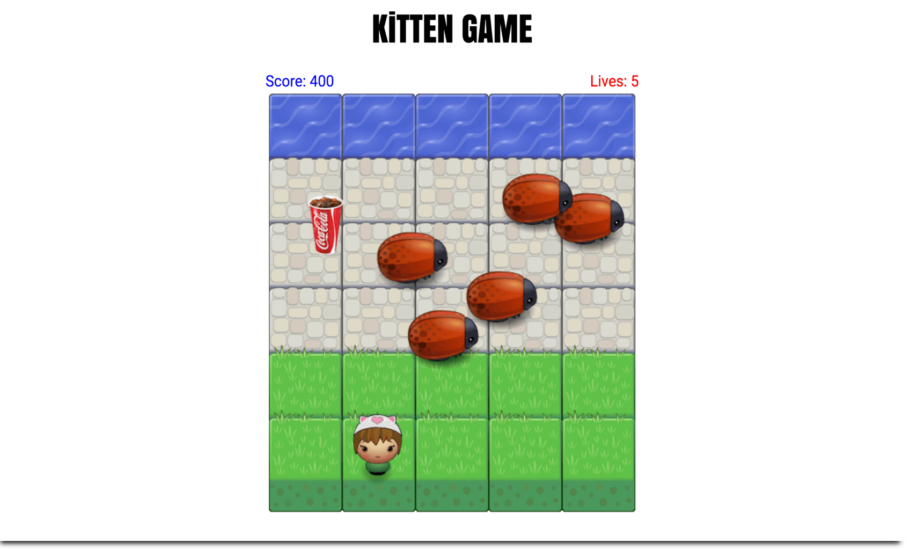

#Classic Arcade Game Clone

###Project Information:
A video game based off the 1981 iconic video game "Frogger". I used HTML5 Canvas, CSS and JavaScript to build this project.

The instructions on how to play are listed below.

###Game Play Instructions:

* Use the arrow keys to move up, down, left and right.
* Colliding with a bug results in the loss of one of your lives.
* Your player/Kitten gets **NINE** lives!
* Collect 50 points by crossing the stone tiles & making it to the water without running into a bug.
* Getting to the water tiles will respawn you to the original staring point.
* Collect 100 points by collecting random items (_e.g._ _shopping bag,_ _chocolate bar,_ _pizza,_ _soda_ _or_ _coffee_) that spawn on the game canvas.

###Technologies Used:
* HTML Canvas
* CSS
* Javascript
* Grunt

###Demo:
[**Click Here**](http://samurairanderson.github.io/P3-Classic-Arcade-Game-Clone) if you have a couple of minutes and give it a go!! Good luck & thanks for playing!!

